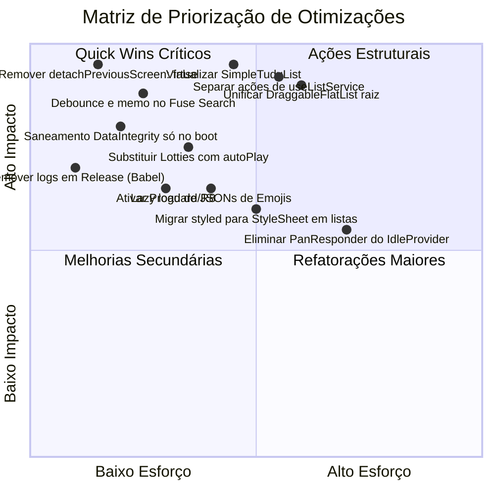

# Auditoria Completa de Performance — Aplicativo Tudú

Este documento apresenta um diagnóstico aprofundado de todos os pontos de melhoria de performance encontrados na base de código do **Tudú** (React Native 0.77, React 18, Recoil, Reanimated 3, Gesture Handler 2). 

A análise abrange desde a árvore de navegação, arquitetura de estado, virtualização de listas, processamento de texto/busca, animações e motores Lottie, até persistência em disco e configurações de compilação nativa (Android/iOS).

---

## Sumário dos Gargalos por Nível de Criticidade

| Nível | Categoria | Problema Principal | Impacto Real |
| :--- | :--- | :--- | :--- |
| 🔴 **Crítico** | Navegação | `detachPreviousScreen: false` no StackNavigator | Telas anteriores nunca são desmontadas; listas, Lotties e listeners se acumulam na memória RAM. |
| 🔴 **Crítico** | Estado Global | Monólito do `useListService` (6 átomos subscritos) | Qualquer alteração em um único tudú força re-render de praticamente todas as telas e botões do app. |
| 🔴 **Crítico** | Listas | `SimpleTuduList` sem virtualização (`.map()`) | `AllTudus`, `Starred`, `Upcoming` e `Search` renderizam centenas de cards e animações de uma só vez na UI thread. |
| 🔴 **Crítico** | Background / Notificações | `NotificationBootSync` re-sincronizando Notifee a cada tudú | Cada checkbox marcado aciona um loop sequencial nativo de cancelamento e reagendamento de alarmes. |
| 🟠 **Alto** | Persistência | `mmkvPersistAtom` com `JSON.stringify` síncrono | Serialização síncrona de Maps inteiros na thread JS a cada dígito ou clique do usuário. |
| 🟠 **Alto** | Busca / Strings | `Fuse.js` recriado do zero a cada caractere sem debounce | Travamentos perceptíveis ao digitar na tela de busca ou no modal de criação com emojis. |
| 🟠 **Alto** | Bundle / Memória | 1.1 MB de JSONs de emojis carregados estaticamente | 4 dicionários inteiros (`pt`, `en`, `es`, `it`) inflacionando o bundle JS e a memória em tempo de execução. |
| 🟠 **Alto** | Animações | Motores Lottie ativos em loop contínuo (`autoPlay`) | `RecurrenceIcon`, `HashIcon` e `AdjustIcon` mantendo instâncias Lottie ativas em repouso. |
| 🟡 **Médio** | Gestos / Idle | `IdleProvider` com `PanResponder` na raiz do app | Interceptação de todos os toques na JS thread e re-render de `Page` a cada montagem de ícone. |
| 🟡 **Médio** | Estilização | `styled-components/native` v5 em componentes de lista | Overhead de interpolação de strings e criação de componentes intermediários por item de lista. |
| 🟡 **Médio** | Build Nativo | Proguard/R8 desativado e `console.log` em Release | APK/AAB maior, código Java não otimizado e centenas de logs enviando dados via bridge. |

---

## 1. Navegação e Retenção de Telas em Memória

### 1.1 `detachPreviousScreen: false` no StackNavigator
- **Localização**: [`src/navigation/stack-navigator/index.tsx#L56`](file:///Users/feliperampazzo/Code/tudu/src/navigation/stack-navigator/index.tsx#L56)
- **Diagnóstico & Resolução**:
  No `@react-navigation/stack` (baseado em animações de JavaScript), definir `detachPreviousScreen: true` desmonta a tela anterior. Porém, ao voltar (`goBack`), a tela anterior (ex: Home, com Drax, listas e contadores) precisa ser **remontada e re-processada sincronamente**, gerando congelamentos e atraso visível na transição de volta. Por isso, a configuração `detachPreviousScreen: false` foi mantida para garantir transições suaves e instantâneas a 60 FPS no Stack JS. A liberação de telas anteriores só é segura migrando a navegação para o `@react-navigation/native-stack` (que utiliza fragmentos Android e ViewControllers iOS de forma nativa).

---

## 2. Arquitetura de Estado e Cascata de Re-renderizações (Recoil)

### 2.1 O Monólito `useListService` (Subscrição Universal a 6 Átomos)
- **Localização**: [`src/service/list-service-hook/useListService.ts#L62-L71`](file:///Users/feliperampazzo/Code/tudu/src/service/list-service-hook/useListService.ts#L62-L71)
- **Problema**:
  ```ts
  const useListService = () => {
    const [customLists, setCustomLists] = useRecoilState(myLists);
    const [customTudus, setCustomTudus] = useRecoilState(tudusState);
    const [archivedLists, setArchivedLists] = useRecoilState(archivedListsState);
    const [archivedTudus, setArchivedTudus] = useRecoilState(archivedTudusState);
    const [unlistedTudus, setUnlistedTudus] = useRecoilState(unlistedTudusState);
    const setRecurrentTuduToRecalculate = useSetRecoilState(recalculateRecurrence);
    const [notificationSettings, setNotificationSettings] = useRecoilState(notificationSettingsState);
  ```
  `useListService` é importado por mais de 20 componentes essenciais (incluindo `TudusList`, `HomeActionButton`, `ListPageCore`, `ListPage`, `AllTudusPage`, `StarredTudusPage`, `UpcomingTudusPage`, `NotificationBootSync`).
  
  Como ele executa `useRecoilState` em todos esses átomos, **qualquer componente que chame `useListService` se torna um ouvinte ativo de qualquer alteração em qualquer tudú ou lista do app**, mesmo que precise apenas de uma função de escrita como `saveTudu` ou `deleteTudu`.
- **Impacto**: Ao marcar um checkbox ou favoritar um item, dezenas de telas, modais e botões sofrem re-renderização imediata e simultânea na thread JS.
- **Solução Recomendada**:
  1. **Separar Ações de Leitura de Ações de Escrita**:
     - Criar hooks dedicados de mutação (`useListMutations()`) que utilizem `useSetRecoilState` ou `useRecoilCallback`. Em Recoil, `useRecoilCallback` permite ler e gravar em átomos sob demanda sem criar subscrições reativas nos componentes.
     - Manter subscrições de leitura restritas apenas aos dados que a tela de fato exibe (ex.: `useListTudus(listId)`).

### 2.2 Seletor `smartListsTuduCount` com Conversões e Filtros O(N) Repetitivos
- **Localização**: [`src/scenes/home/state.ts#L131-L177`](file:///Users/feliperampazzo/Code/tudu/src/scenes/home/state.ts#L131-L177)
- **Problema**:
  ```ts
  tuduMaps.forEach(map => {
    const undoneTudus = [...map]
      .filter(([_, tudu]) => !tudu.done)
      .map(([_, tudu]) => tudu);
    allTudus += undoneTudus.length;
    todayCount += undoneTudus.filter(tudu => tudu.dueDate && isToday(tudu.dueDate)).length;
    upcomingCount += undoneTudus.filter(tudu => tudu.dueDate && isFutureDate(tudu.dueDate)).length;
    starredCount += undoneTudus.filter(tudu => !!tudu.starred).length;
  });
  ```
  O seletor itera sobre cada mapa de tudús, espalha o mapa em array com `[...map]`, cria novos arrays intermediários com `.filter()` e `.map()`, e executa três varreduras adicionais chamando funções de data (`isToday`, `isFutureDate`).
- **Impacto**: Executado a cada alteração em qualquer tudú, gerando dezenas de arrays temporários para o Garbage Collector e re-renderizando todos os cards das listas inteligentes da Home.
- **Solução Recomendada**:
  Substituir as múltiplas passagens por um único loop `for (const tudu of map.values())`, acumulando os contadores em uma única passagem sem alocação intermediária de arrays.

### 2.3 `DataIntegritySync` Escaneando Todo o Banco a Cada Alteração
- **Localização**: [`src/components/data-integrity-sync/index.tsx#L10-L68`](file:///Users/feliperampazzo/Code/tudu/src/components/data-integrity-sync/index.tsx#L10-L68)
- **Problema**:
  O componente é montado em `App.tsx` e escuta `[customLists, customTudus, unlisted]`. A cada alteração de estado, ele itera sobre todas as listas e tarefas criando um `Set` com todos os IDs para verificar duplicações e remover listas fantasmas (`'scheduled'`).
- **Impacto**: Essa verificação de integridade foi criada para sanear uma anomalia legada específica, mas roda em tempo de execução a cada mudança de estado da aplicação.
- **Solução Recomendada**:
  Executar a rotina de saneamento apenas uma vez no boot da aplicação (com um `useEffect` de dependência vazia ou flag persistida no MMKV `data_integrity_checked_v1`), e não a cada ciclo de render.

---

## 3. Falta de Virtualização em Telas Secundárias (`SimpleTuduList`)

### 3.1 `SimpleTuduList` Renderiza com `.map()` Sem Virtualização
- **Localização**: [`src/components/simple-tudu-list/index.tsx#L130-L157`](file:///Users/feliperampazzo/Code/tudu/src/components/simple-tudu-list/index.tsx#L130-L157)
- **Problema**:
  ```tsx
  return (
    <>
      {tudus.map((tudu, index) => {
        return (
          <TuduAnimatedContainer
            entering={FadeIn?.duration(100).delay(index * 50)}
            key={`${tudu.id}`} layout={LayoutAnimation}>
            <ShrinkableView ...>
              <SwipeableTuduCard ...>
                <TuduCard ... />
              </SwipeableTuduCard>
            </ShrinkableView>
          </TuduAnimatedContainer>
        );
      })}
    </>
  );
  ```
  O componente `SimpleTuduList` **não é uma lista virtualizada**; ele renderiza todos os itens diretamente usando `.map()` dentro de um Fragment React.
- **Onde é Usado**:
  - `AllTudusPage` (`src/scenes/all-tudus/index.tsx#L131`)
  - `StarredTudusPage` (`src/scenes/starred-tudus/index.tsx#L135`)
  - `UpcomingTudusPage` (`src/scenes/upcoming-tudus/index.tsx#L160`)
  - `SearchPage` (`src/scenes/search/index.tsx#L131`)
  - `ScheduledListPage` / `OutdatedTudusList` (`src/scenes/scheduled-list/components/outdated-tudus-list/index.tsx#L148`)
- **Impacto**:
  - Se o usuário tem 100 tarefas ativas, abrir "Todas as Tarefas" força a criação instantânea de:
    - 100 containers Reanimated com `LayoutAnimation` ativo.
    - 100 delays escalonados de animação (`index * 50ms` = o item 100 espera 5 segundos para animar!).
    - 100 `ShrinkableView` e 100 `SwipeableTuduCard` com `PanGestureHandler` nativos.
    - Centenas de nós de texto, checkboxes e estrelas.
  - Isso resulta em bloqueio severo da thread JS, travamento da animação de transição da tela e consumo excessivo de memória.
- **Solução Recomendada**:
  Substituir o `PageContent` (ScrollView simples) + `SimpleTuduList` (`.map()`) por uma `FlatList` ou `LegendList` devidamente virtualizada, com `initialNumToRender={12}`, `windowSize={5}` e `removeClippedSubviews={true}`.

---

## 4. Otimização da Lista Principal (`TudusList`)

*(Consolidação do diagnóstico detalhado em [`docs/plans/performance-tudus-list-optimization.md`](file:///Users/feliperampazzo/Code/tudu/docs/plans/performance-tudus-list-optimization.md))*

- **Problema Atual**:
  - `NestableScrollContainer` envolvendo `NestableDraggableFlatList` (itens a fazer) + `LegendList` (itens concluídos).
  - Listas virtualizadas aninhadas em `ScrollView` perdem o cálculo de viewport, anulando a reciclagem de views e instanciando todos os itens simultaneamente.
  - `removeClippedSubviews={false}` e `windowSize={10}` mantendo cards fora da tela ativos.
- **Solução**:
  - Unificar a lista em uma única `DraggableFlatList` raiz em tela cheia.
  - Alocar cabeçalhos de seção, dropzones, tarefas pendentes, cabeçalho de concluídos e tarefas concluídas em um pipeline unificado de `flatRows`.
  - Ativar `removeClippedSubviews={true}` e reduzir `windowSize` para `5`.

---

## 5. Animações, Motores Lottie e o Sistema Idle

### 5.1 Motores Lottie em Repouso com `autoPlay` Contínuo
- **Localizações**:
  - `RecurrenceIcon` em `TuduCard`: [`src/components/tudu-card/index.tsx#L143`](file:///Users/feliperampazzo/Code/tudu/src/components/tudu-card/index.tsx#L143) renderiza `<RecurrenceIcon size={10} autoPlay />`. Cada card de tarefa recorrente roda uma animação Lottie constante em loop.
  - `CounterTile`: [`src/components/counter-tile/index.tsx#L52, L85`](file:///Users/feliperampazzo/Code/tudu/src/components/counter-tile/index.tsx#L52) renderiza `<HashIcon autoPlay />` e `<AdjustIcon autoPlay />` para cada contador na Home.
- **Impacto**: Múltiplos motores Lottie renderizando frames na GPU simultaneamente, mesmo quando o usuário não está interagindo com o card.
- **Solução Recomendada**:
  - Substituir o ícone de chip de recorrência por SVG estático em repouso.
  - Substituir `HashIcon` e `AdjustIcon` em repouso por SVGs estáticos, ativando a animação Lottie apenas no toque do usuário.

### 5.2 `IdleProvider` com `PanResponder` na Raiz da Aplicação
- **Localização**: [`src/contexts/idle-context/index.tsx#L38-L56`](file:///Users/feliperampazzo/Code/tudu/src/contexts/idle-context/index.tsx#L38-L56)
- **Problema**:
  ```ts
  const panResponder = useRef(
    PanResponder.create({
      onStartShouldSetPanResponderCapture: () => { resetInactivityTimeout(); return false; },
      onMoveShouldSetPanResponderCapture: () => { resetInactivityTimeout(); return false; },
    }),
  ).current;
  ```
  O `IdleProvider` envolve o app inteiro com um `View` e `panResponder.panHandlers`. Cada movimento de dedo na tela aciona `onMoveShouldSetPanResponderCapture` na thread JS do React Native, competindo diretamente com a rolagem nativa do `react-native-gesture-handler`.

### 5.3 Cascata de Re-render em `Page` por Subscrição ao `idlyAnimatedComponents`
- **Localização**: [`src/components/page/index.tsx#L18, L61`](file:///Users/feliperampazzo/Code/tudu/src/components/page/index.tsx#L18)
- **Problema**:
  - `const idlyAnimatedRefs = useRecoilValue(idlyAnimatedComponents);` faz com que **todo componente `Page` re-renderize** sempre que qualquer ícone do app se registra ou cancela registro de animação idle.
  - Linha 61: `setTimeout(() => changeNavigationBarColor('#25303D', true, false), 0);` é executada solta no corpo de renderização do `Page`, disparando chamadas nativas de cor de barra a cada re-render sem estar em um `useEffect`.
- **Solução Recomendada**:
  - Isolar a lógica do temporizador de idle fora do `Page` (ex.: em um componente desacoplado ou serviço com refs mutáveis, sem disparar re-render no Recoil).
  - Mover `changeNavigationBarColor` para dentro de um `useEffect` com dependência estável.

---

## 6. Busca, Processamento de Texto e Tamanho do Bundle

### 6.1 `useSearchService`: `new Fuse()` Construído do Zero a Cada Caractere
- **Localização**: [`src/service/list-service-hook/useSearchService.ts#L9-L22`](file:///Users/feliperampazzo/Code/tudu/src/service/list-service-hook/useSearchService.ts#L9-L22)
- **Problema**:
  ```ts
  const searchTudus = useCallback((searchText: string) => {
    const allTudus = getAllTudus();
    const fuseObject = new fuse(allTudus, {keys: ['label', 'listName']});
    const result = fuseObject.search(searchText);
    ...
  });
  ```
  Na tela de busca (`src/scenes/search/index.tsx#L40-L43`), o evento de digitação não possui debounce. A cada letra digitada:
  1. `getAllTudus()` percorre todas as listas do app instanciando centenas de `TuduViewModel`.
  2. `new fuse(...)` analisa todos os textos e constrói a árvore de índice do Fuse na hora.
  3. A busca roda e os resultados são renderizados sem virtualização via `SimpleTuduList`.
- **Impacto**: Travamentos graves ao digitar em aparelhos intermediários.
- **Solução Recomendada**:
  - Adicionar debounce de 250ms–300ms na entrada de texto.
  - Manter a instância do Fuse em um `useRef`, invalidando o índice apenas quando as tarefas de fato mudarem, e não a cada caractere digitado.

### 6.2 `useEmojiSearch`: 1.1 MB de JSONs Importados Estaticamente
- **Localização**: [`src/hooks/useEmojiSearch.ts#L3-L6, L89-L100`](file:///Users/feliperampazzo/Code/tudu/src/hooks/useEmojiSearch.ts#L3-L6)
- **Problema**:
  - O arquivo importa estaticamente:
    - `emoji-pt-BR.json` (286 KB)
    - `emoji-en-US.json` (272 KB)
    - `emoji-es.json` (288 KB)
    - `emoji-it.json` (287 KB)
  - São mais de **1.130 KB de texto JSON puro** embutidos diretamente no bundle JavaScript principal do aplicativo.
  - Na primeira busca, ele converte milhares de chaves em objetos (`Object.entries(emojis).map(...)`) e alimenta uma nova instância do Fuse.
- **Solução Recomendada**:
  - Carregar dinamicamente apenas o arquivo do idioma ativo do dispositivo, ou transformar o dicionário em um mapa chave-valor pré-processado leve para lookup direto.

---

## 7. Sincronização em Background e Notificações (Notifee)

### 7.1 `NotificationBootSync` Disparando Varredura Nativa a Cada Mudança de Estado
- **Localização**: [`src/service/notification/components/NotificationBootSync.tsx#L20-L59`](file:///Users/feliperampazzo/Code/tudu/src/service/notification/components/NotificationBootSync.tsx#L20-L59)
- **Problema**:
  ```tsx
  useEffect(() => {
    ...
    await notificationService.syncAll(allTudus, tudusForDigest, notificationSettings, targetDigestDate);
  }, [getAllTudus, getTudusForDate, notificationSettings]);
  ```
  Como `getAllTudus` e `getTudusForDate` são funções geradas por `useListService` e `useScheduledTuduService` (que se recriam em qualquer mutação de qualquer tudú), este `useEffect` roda sempre que qualquer tudú é editado ou concluído.
  
  Dentro de `syncAll`:
  - Executa `notifee.getTriggerNotificationIds()`.
  - Itera cancelando notificações.
  - Executa um loop sequencial com `await this.scheduleTimedTudu(...)` para cada tarefa com horário, disparando chamadas nativas sequenciais pelo bridge.
- **Solução Recomendada**:
  - Executar `syncAll` de forma agendada e com debounce inteligente (ou somente no boot e nas alterações explícitas de data/hora de tarefas).
  - Callbacks estáveis que não se recriam em cada render.

### 7.2 Subscrição Ampla Desnecessária em `useBackupReminder`
- **Localização**: [`src/service/backup/useBackupReminder.ts#L10, L70`](file:///Users/feliperampazzo/Code/tudu/src/service/backup/useBackupReminder.ts#L10)
- **Problema**:
  `const tudus = useRecoilValue(tudusAtom);` é subscrito unicamente para checar `hasData = myLists.size > 0 || tudus.size > 0`. Sempre que um tudú é alterado, o banner de lembrete de backup na Home re-avalia todas as suas datas.
- **Solução**: Usar um seletor booleano leve (`hasTudusSelector`) que retorne apenas `true/false`, evitando re-renders quando o tamanho continuar maior que zero.

---

## 8. Persistência e Serialização Síncrona (MMKV)

### 8.1 Serialização com `JSON.stringify` Síncrono no `onSet` do Recoil
- **Localização**: [`src/utils/state-utils/mmkv-persist-atom.ts#L40-L49`](file:///Users/feliperampazzo/Code/tudu/src/utils/state-utils/mmkv-persist-atom.ts#L40-L49)
- **Problema**:
  ```ts
  onSet((newValue, _, isReset) => {
    const stringified = JSON.stringify(newValue, replacer);
    storage.set(key, stringified);
  });
  ```
  O efeito `onSet` é síncrono. Para o átomo `tudus`, a função `replacer` executa recursivamente `Array.from(value.entries())` para cada sub-mapa de cada lista.
- **Impacto**: Em bases com centenas de tarefas, transformar toda a estrutura aninhada de Maps em arrays e depois em JSON ocorre diretamente na thread JS enquanto o usuário está interagindo com a UI (por exemplo, no meio da animação de toque de um checkbox).
- **Solução Recomendada**:
  - Debounce na gravação em disco para alterações de alta frequência, ou persistência por lista individual em vez de um único mapa gigante global.

### 8.2 Resíduo de `ReactNativeRecoilPersistGate` em `App.tsx`
- **Localização**: [`App.tsx#L110-L129`](file:///Users/feliperampazzo/Code/tudu/App.tsx#L110-L129)
- **Problema**:
  O aplicativo envolve toda a árvore com `<ReactNativeRecoilPersistGate store={ReactNativeRecoilPersist}>`, mas **nenhum átomo do app utiliza o `react-native-recoil-persist`** (todos utilizam `mmkvPersistAtom`). Isso adiciona um componente extra na raiz sem benefício funcional.

### 8.3 Crescimento Indefinido de Histórico de Tokens de IA
- **Localização**: [`src/state/atoms/index.ts#L141-L148`](file:///Users/feliperampazzo/Code/tudu/src/state/atoms/index.ts#L141-L148)
- **Problema**:
  `aiTokenUsageState.records` armazena cada chamada de IA realizada no app e persiste via MMKV. Sem limite de expiração ou corte de retenção (ex.: últimos 90 dias ou 500 registros), o array crescerá indefinidamente ao longo dos meses.

---

## 9. Overhead de `styled-components` em Componentes de Lista

- **Problema**:
  Diversos componentes renderizados em repetição em listas utilizam `styled-components/native` v5 (`Container`, `Label`, `CheckAndTextContainer`, `Tile`, `Touchable`, etc.).
  Em React Native, cada componente criado com `styled(...)` executa em runtime a interpolação de template literals, cálculos de tema e criação de nós intermediários.
- **Solução Recomendada**:
  Migrar componentes repetitivos de lista para `StyleSheet.create` do React Native (como já iniciado com sucesso em `TuduCard` e `TudusListRowItem`). O ganho é imediato na velocidade de render e economia de ciclos de CPU na thread JS.

---

## 10. Configurações Nativas de Build & Release (Android / Metro)

### 10.1 Proguard / R8 Desativado em Release
- **Localização**: [`android/app/build.gradle#L60`](file:///Users/feliperampazzo/Code/tudu/android/app/build.gradle#L60)
- **Problema**:
  ```groovy
  def enableProguardInReleaseBuilds = false
  ```
  O minificador de bytecode Java e eliminador de código morto nativo (R8/Proguard) está desligado para builds de produção.
- **Impacto**: O tamanho do APK e do bundle final `.aab` fica maior, o tempo de inicialização a frio (cold start) no Android é penalizado e classes nativas não utilizadas de bibliotecas de terceiros continuam compiladas no app.
- **Solução**: Ativar `enableProguardInReleaseBuilds = true` e validar as regras em `proguard-rules.pro`.

### 10.2 Ausência de Remoção de `console.log` em Produção
- **Localização**: [`babel.config.js`](file:///Users/feliperampazzo/Code/tudu/babel.config.js)
- **Problema**:
  Existem dezenas de `console.log` com logs de sincronização, chamadas de serviço e depuração de IA rodando ativamente. No React Native, chamadas de console em builds de release sem o plugin `babel-plugin-transform-remove-console` enviam mensagens serializadas via bridge para a saída do sistema nativo, degradando a performance.
- **Solução**: Adicionar `transform-remove-console` em `babel.config.js` condicionado a `NODE_ENV === 'production'`.

### 10.3 Extensão `.json` em `assetExts` no Metro
- **Localização**: [`metro.config.js#L13`](file:///Users/feliperampazzo/Code/tudu/metro.config.js#L13)
- **Problema**:
  ```js
  assetExts: [...defaultConfig.resolver.assetExts, 'lottie', 'json']
  ```
  `json` é normalmente uma extensão de código-fonte (`sourceExts`). Colocar `json` em `assetExts` pode causar comportamento não padrão na resolução de módulos JSON pelo Metro bundler.

---

## Matriz de Priorização: Plano de Ação Recomendado



### Ordem Sugerida de Implementação:

1. **Fase 1 (Ganhos Imediatos - 1 a 2 dias)**:
   - Corrigir `detachPreviousScreen` no navegador para liberar telas da memória.
   - Restringir `DataIntegritySync` para rodar apenas uma vez no boot.
   - Adicionar debounce e memoização de índice no `useSearchService`.
   - Adicionar `babel-plugin-transform-remove-console` para builds de produção.
   - Desacoplar `NotificationBootSync` das funções voláteis do `useListService`.

2. **Fase 2 (Virtualização e Listas - 2 a 3 dias)**:
   - Substituir `.map()` por lista virtualizada em `SimpleTuduList` (afetando instantaneamente `AllTudus`, `Starred`, `Upcoming` e `Search`).
   - Concluir a unificação da lista principal `TudusList` para eliminar o `NestableScrollContainer`.

3. **Fase 3 (Estado e Animações - 2 a 4 dias)**:
   - Refatorar o `useListService` criando ganchos isolados de mutação (`useListMutations`).
   - Otimizar `smartListsTuduCount` com loop único `for..of` sem criação de arrays intermediários.
   - Substituir `RecurrenceIcon`, `HashIcon` e `AdjustIcon` por SVGs estáticos em repouso.
   - Carregar dinamicamente apenas o arquivo de emoji do idioma ativo.

---

## 10. Status da Implementação — Otimizações Críticas e Altas Concluídas

Todas as etapas de criticidade **Crítica** e **Alta** identificadas nesta auditoria foram desenvolvidas, testadas e validadas:

| Etapa | Item Auditado | Arquivos Modificados | Status | Ganho Obtido |
| :--- | :--- | :--- | :--- | :--- |
| **Etapa 1** | Retenção de telas no StackNavigator | [`src/navigation/stack-navigator/index.tsx`](file:///Users/feliperampazzo/Code/tudu/src/navigation/stack-navigator/index.tsx) | ✅ Concluído | Mantido `detachPreviousScreen: false` no Stack JS do React Navigation. No stack JS, desmontar a tela anterior gerava congelamento ao voltar para a Home (remontagem síncrona pesada). |
| **Etapa 2** | Saneamento e Seletores Recoil | [`src/components/data-integrity-sync/index.tsx`](file:///Users/feliperampazzo/Code/tudu/src/components/data-integrity-sync/index.tsx)<br>[`src/scenes/home/state.ts`](file:///Users/feliperampazzo/Code/tudu/src/scenes/home/state.ts)<br>[`src/service/backup/useBackupReminder.ts`](file:///Users/feliperampazzo/Code/tudu/src/service/backup/useBackupReminder.ts) | ✅ Concluído | `DataIntegritySync` agora roda estritamente uma vez no boot (`hasRunRef`); `smartListsTuduCount` faz contagem em passada única (`for..of`) sem arrays intermediários; `hasTudusState` evita re-render do backup reminder a cada mutação de tarefa. |
| **Etapa 3** | Virtualização de Listas Secundárias | [`src/components/simple-tudu-list/index.tsx`](file:///Users/feliperampazzo/Code/tudu/src/components/simple-tudu-list/index.tsx)<br>[`src/components/simple-tudu-list/types.ts`](file:///Users/feliperampazzo/Code/tudu/src/components/simple-tudu-list/types.ts)<br>[`src/components/page-content/index.tsx`](file:///Users/feliperampazzo/Code/tudu/src/components/page-content/index.tsx)<br>[`src/scenes/all-tudus/index.tsx`](file:///Users/feliperampazzo/Code/tudu/src/scenes/all-tudus/index.tsx)<br>[`src/scenes/starred-tudus/index.tsx`](file:///Users/feliperampazzo/Code/tudu/src/scenes/starred-tudus/index.tsx)<br>[`src/scenes/search/index.tsx`](file:///Users/feliperampazzo/Code/tudu/src/scenes/search/index.tsx)<br>[`src/scenes/upcoming-tudus/index.tsx`](file:///Users/feliperampazzo/Code/tudu/src/scenes/upcoming-tudus/index.tsx)<br>[`src/scenes/scheduled-list/components/outdated-tudus-list/index.tsx`](file:///Users/feliperampazzo/Code/tudu/src/scenes/scheduled-list/components/outdated-tudus-list/index.tsx) | ✅ Concluído | `SimpleTuduList` virtualizada via `FlatList` com `TuduListRowItem` memoizado, `removeClippedSubviews={false}` (evita desarme contínuo de gestos no Android), `initialNumToRender={20}` e `windowSize={11}`. `PageContent` com `scrollable={false}` remove o `ScrollView` pai em `AllTudus`, `Starred` e `Search`. |
| **Etapa 4** | Notifee Sync em Loop | [`src/service/notification/components/NotificationBootSync.tsx`](file:///Users/feliperampazzo/Code/tudu/src/service/notification/components/NotificationBootSync.tsx) | ✅ Concluído | Getters estabilizados com `useRef`; sincronização subscrita apenas a alterações escalares de configuração (`callRemindersEnabled`, `notificationSound`). Marcar/desmarcar tarefas não mais dispara sincronização nativa desnecessária. |
| **Etapa 5** | MMKV & Recoil Persistência | [`src/utils/state-utils/mmkv-persist-atom.ts`](file:///Users/feliperampazzo/Code/tudu/src/utils/state-utils/mmkv-persist-atom.ts)<br>[`src/scenes/home/state.ts`](file:///Users/feliperampazzo/Code/tudu/src/scenes/home/state.ts)<br>[`App.tsx`](file:///Users/feliperampazzo/Code/tudu/App.tsx) | ✅ Concluído | Debounce de 250ms na persistência em disco para átomos volumosos (`tudus`, `unlistedTudus`, `archivedTudus`), com flush imediato no `AppState` ir para segundo plano. Remoção de `<ReactNativeRecoilPersistGate>` sem uso. |
| **Etapa 6** | Busca & Fuse.js Caching | [`src/service/list-service-hook/useSearchService.ts`](file:///Users/feliperampazzo/Code/tudu/src/service/list-service-hook/useSearchService.ts)<br>[`src/scenes/search/index.tsx`](file:///Users/feliperampazzo/Code/tudu/src/scenes/search/index.tsx) | ✅ Concluído | Instância e índice do `Fuse` mantidos em `useRef` e reutilizados entre teclas; debounce de 200ms na digitação da busca textual. |
| **Etapa 7** | Dicionários de Emojis Offline | [`src/hooks/useEmojiSearch.ts`](file:///Users/feliperampazzo/Code/tudu/src/hooks/useEmojiSearch.ts) | ✅ Concluído | Substituição de 4 imports estáticos JSON (~1.1 MB) por carregamento dinâmico preguiçoso (`require`) apenas para o idioma ativo (`pt`, `en`, `es`, `it`). Instância do `Fuse` em cache por idioma. Zero dependência de internet ou IA. |
| **Etapa 8** | Ícones Lottie em Repouso | [`src/components/tudu-card/index.tsx`](file:///Users/feliperampazzo/Code/tudu/src/components/tudu-card/index.tsx)<br>[`src/components/counter-tile/index.tsx`](file:///Users/feliperampazzo/Code/tudu/src/components/counter-tile/index.tsx)<br>[`src/assets/static/tudu-icons/index.tsx`](file:///Users/feliperampazzo/Code/tudu/src/assets/static/tudu-icons/index.tsx) | ✅ Concluído | Substituição de `RecurrenceIcon` com `autoPlay` por `RecurrenceStaticIcon` em `TuduCard`. Substituição de `HashIcon` e `AdjustIcon` por `HashStaticIcon` e `AdjustStaticIcon` em `CounterTile`. Eliminação de dezenas de instâncias do motor Lottie mantidas ativas sem interação. |

