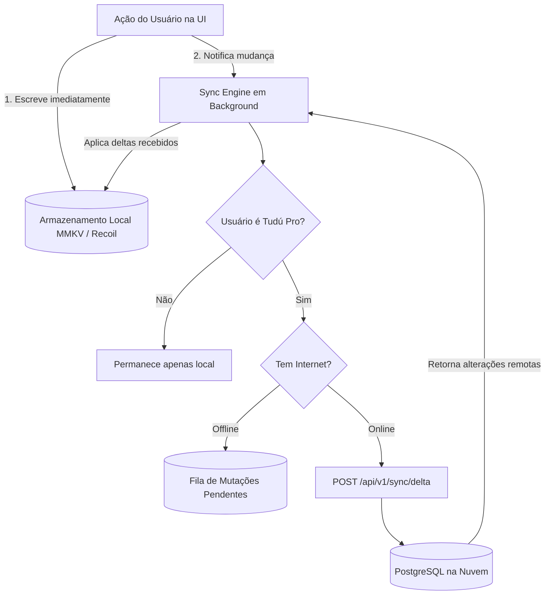

# Plano de Adaptação do App: Tudú Client com Assinatura (Tudú Pro), Sincronização em Nuvem e Modo BYOK

> **Status:** Atualizado (V2 - Assinatura, Nuvem & Anti-Abuso)  
> **Data:** 28 de Setembro de 2026  
> **Autor / Projeto:** Tudú Team  
> **Escopo:** Atualização completa do aplicativo Tudú (React Native) para suportar a assinatura **Tudú Pro (R$ 4,90/mês com 7 dias grátis)**, sincronização automática em nuvem para assinantes mantendo o funcionamento **100% offline-first**, e consumo seguro da API de IA gerenciada com suporte contínuo a chave própria (BYOK).

---

## 1. Princípios e Regras de Negócio

1. **Continuidade Offline-First Imutável:**
   - O usuário nunca fica bloqueado aguardando requisições de rede. Todas as criações, edições, marcações de tarefas e navegações acontecem instantaneamente no armazenamento local (MMKV / estado Recoil).
   - O funcionamento offline é o núcleo do Tudú, tanto para usuários gratuitos quanto para assinantes.
2. **Modelo de Assinatura (Tudú Pro):**
   - **Preço:** **R$ 4,90 / mês** (cobrança via Google Play Billing / Apple App Store).
   - **Período de Testes:** **Primeira semana grátis (7 dias de trial)** ao contratar.
   - **Benefícios Inclusos no Tudú Pro:**
     1. **IA Gerenciada sem Chaves:** Emojis automáticos, geração de subtarefas e interpretação inteligente de listas via API oficial do Tudú.
     2. **Sincronização & Backup Contínuo em Nuvem:** Todas as listas, tarefas, contadores e configurações salvas com segurança no banco de dados na nuvem (PostgreSQL), permitindo restauração instantânea e multi-dispositivo.
3. **Liberdade e Modo BYOK (Bring Your Own Key):**
   - Usuários que **não desejam assinar** podem continuar utilizando o Tudú gratuitamente de forma 100% offline.
   - Se quiserem recursos de IA sem assinar, podem continuar cadastrando sua chave própria (Google Gemini, OpenAI ou Claude) sem custos adicionais.
4. **Proteção de Dados & Migração ao Assinar:**
   - Ao assinar o plano Tudú Pro, o app realiza uma **migração instantânea sem atrito**: todos os dados locais existentes no celular são empacotados e enviados para o banco de dados na nuvem (`POST /api/v1/sync/snapshot`), garantindo que o usuário não perca nenhuma anotação.

---

## 2. Nova Arquitetura de Estado e Autenticação

Para associar a assinatura e os dados na nuvem ao usuário, implementaremos login social simples (Google Sign-In e Apple Sign-In).

```
┌─────────────────────────────────────────────────────────────────┐
│                     ESTADO GLOBAL (RECOIL ATOMS)                │
├────────────────────────────────┬────────────────────────────────┤
│ userSessionState               │ subscriptionState              │
│ - user: { id, email, name }    │ - isPro: boolean               │
│ - token: string (JWT)          │ - status: 'trialing'|'active'..│
│ - provider: 'google' | 'apple' │ - trialEndsAt: string          │
├────────────────────────────────┼────────────────────────────────┤
│ cloudSyncState                 │ aiSettingsState                │
│ - isSyncing: boolean           │ - mode: 'managed' | 'byok'     │
│ - lastSyncAt: number           │ - byokProvider: 'openai'|...   │
│ - pendingMutationsCount: number│ - aiEmojiSuggestionsEnabled    │
└────────────────────────────────┴────────────────────────────────┘
```

### 2.1 Identidade do Usuário
* **Google Sign-In:** O app já possui o pacote `@react-native-google-signin/google-signin` instalado e configurado (usado no backup do Google Drive). Iremos estender seu uso para autenticar na API Tudú.
* **Apple Sign-In:** Instalação do `@invertase/react-native-apple-authentication` (requisito obrigatório da Apple para apps com compras e login social no iOS).

---

## 3. Motor de Sincronização em Nuvem Offline-First (`SyncEngine`)

Para manter a interface rápida e 100% responsiva sem travas de rede, adotamos uma fila de mutações em segundo plano:



### 3.1 Estrutura da Mutações Locais (`Sync Engine`)
1. **Marcação de Timestamps (`updatedAt` e `deletedAt`):**
   - Ao alterar qualquer item (tarefa, lista, contador ou configuração), o app atribui `updatedAt: Date.now()`.
   - Ao remover um item, em vez de excluí-lo fisicamente de imediato se for assinante, marca `deletedAt: Date.now()` (soft delete) para que a exclusão seja replicada no servidor na próxima sincronização.
2. **Sincronização Delta (`POST /api/v1/sync/delta`):**
   - Envia apenas os registros criados, editados ou deletados após `lastSyncTimestamp`.
   - O servidor responde com as alterações remotas ocorridas no mesmo período.
   - O app atualiza o estado local mesclando os registros mais recentes (estratégia *Last-Write-Wins*).
3. **Snapshot Inicial:**
   - No momento da contratação da assinatura, o app executa `POST /api/v1/sync/snapshot`, enviando a estrutura do `TuduBackupPayload` (já existente no app) para popular o banco de dados na nuvem de forma integral e atômica.

---

## 4. Integração de Pagamentos: RevenueCat (R$ 4,90/mês com 7 Dias Grátis)

Utilizaremos o SDK oficial **`react-native-purchases`** (RevenueCat):
- Integração padrão da indústria que abstrai a complexidade do Google Play Billing e StoreKit da Apple.
- Gerencia os 7 dias de avaliação gratuita de forma transparente nas duas lojas.
- Permite restaurar compras (`Purchases.restorePurchases()`) ao reinstalar o aplicativo.

### 4.1 Fluxo de Assinatura no App
1. O usuário tenta usar a IA gerenciada sem chave própria OU clica no banner "Sincronização em Nuvem".
2. O **`PaywallModal`** é apresentado com destaque para:
   - **7 dias grátis para testar.**
   - Apenas **R$ 4,90 por mês** após o período de testes.
   - Cancelamento fácil a qualquer momento pelas configurações da loja.
   - Recursos: IA integrada ilimitada + backup em nuvem contínuo em tempo real.
3. Se o usuário confirmar a assinatura:
   - Se ainda não estiver logado com Google/Apple, o modal solicita login social em um clique.
   - A compra da assinatura com trial é confirmada na Play Store / App Store.
   - O SDK do RevenueCat notifica o app e envia o webhook à API Tudú.
   - O estado `subscriptionState` muda para `isPro: true, status: 'trialing'`.
   - O motor de sincronização dispara o envio do snapshot inicial para a nuvem.

---

## 5. Arquitetura do Serviço de IA com Defesa Anti-Abuso

O cliente do app deve colaborar ativamente com as medidas de segurança da API:

```
[ App Tudú ]
  │
  ├─> Validação de Comprimento Local (title <= 100 caracteres)
  ├─> Sanitização e Limpeza de Espaços
  ├─> Envio de Campos Específicos (NUNCA envia prompt aberto)
  │
  ▼
POST /api/v1/ai/suggest-emojis (Bearer Token do Usuário Assinante)
```

### 5.1 Roteamento no `src/service/ai/ai-service.ts`
```typescript
export const suggestEmojisWithAI = async (
  request: EmojiSuggestionRequest,
  timeoutMs: number = 7000,
): Promise<string[]> => {
  const settings = getRecoil(aiSettingsState);
  const subscription = getRecoil(subscriptionState);

  // 1. Se estiver configurado para chave própria (BYOK):
  if (settings.mode === 'byok') {
    return executeLocalByokAdapter(settings.byokProvider, request, timeoutMs);
  }

  // 2. Se for assinante Tudú Pro (ou estiver no trial de 7 dias):
  if (subscription.isPro) {
    try {
      // Chama a API Tudú (que cuidará do DeepSeek com fallback para OpenAI)
      return await requestApiSuggestedEmojis(request, timeoutMs);
    } catch (error: any) {
      if (error?.status === 429) {
        // Alerta de proteção diária atingida
        notifyDailyRateLimit();
      }
      throw error;
    }
  }

  // 3. Não é assinante e não tem chave própria:
  // Abre o Paywall apresentando os 7 dias grátis de Tudú Pro
  openPaywallModal({ feature: 'ai' });
  throw new Error('SUBSCRIPTION_REQUIRED');
};
```

> **Garantia de Modelos OpenAI:**  
> O app e a API mantêm exatamente os dois modelos atualmente em produção no Tudú:
> 1. `gpt-4o-mini`: micro-tarefas de alta velocidade (emojis e sugestões de tarefas).
> 2. `gpt-5.6-luna`: estruturação semântica complexa e agrupamento temático de listas (`parseList`).  
> Tanto em modo BYOK local quanto via API Tudú, o comportamento e a inteligência dos modelos permanecem 100% consistentes.

---

## 6. Telas e Componentes a Serem Criados/Atualizados

### 6.1 `PaywallModal` (`src/components/paywall-modal/`)
- Modal animado e elegante com design premium.
- Elementos:
  - Título: *"Desbloqueie o Tudú Pro"*.
  - Badge: *"7 Dias Grátis"*.
  - Lista de benefícios com ícones:
    - 🧠 **IA Integrada:** Emojis e tarefas inteligentes sem precisar de chaves complexas.
    - ☁️ **Nuvem em Tempo Real:** Seus dados e listas sincronizados e salvos com segurança.
    - 📱 **Multi-dispositivo:** Acesse suas listas onde quiser.
  - Preço: *"R$ 4,90 / mês após a 1ª semana gratuita"*.
  - Botão principal: *"Experimentar 7 Dias Grátis"*.
  - Link secundário: *"Prefiro usar minha própria chave de IA (Gratuito)"* (transparência com o usuário).

### 6.2 Atualização da Tela de Configurações de IA (`src/scenes/settings/ai-settings/index.tsx`)
- Seção superior com o status da assinatura Tudú Pro.
- Se for assinante: exibe badge *"Tudú Pro Ativo"* (com data de renovação ou dias restantes do trial) e opção de usar a IA Tudú Cloud ou alternar para BYOK se preferir.
- Se for gratuito: exibe botão *"Experimentar Tudú Pro (7 dias grátis)"* ou formulário para inserir chave própria (Gemini / OpenAI / Claude).

### 6.3 Indicador Discreto de Sincronização na Home
- Ícone sutil no cabeçalho ou menu lateral:
  - ☁️ *(check)*: "Sincronizado na Nuvem".
  - 🔄 *(girando)*: "Sincronizando...".
  - ⚠️: "Trabalhando Offline (salvo no dispositivo)".

---

## 7. Pacotes a Instalar no App

```bash
# RevenueCat para In-App Subscriptions (R$ 4,90/mês e 7 dias de trial)
yarn add react-native-purchases

# Apple Sign-In para iOS
yarn add @invertase/react-native-apple-authentication
```

*Nota: `@react-native-google-signin/google-signin` e `react-native-mmkv` já estão instalados no projeto.*

---

## 8. Fases de Execução no App

### Fase 1: Dependências, Autenticação & RevenueCat
1. Instalar `react-native-purchases` e `@invertase/react-native-apple-authentication`.
2. Configurar chaves públicas do RevenueCat para Android e iOS.
3. Criar serviço de autenticação (`src/service/auth/auth-service.ts`) para autenticar com Google e Apple e trocar por JWT na API Tudú.

### Fase 2: Paywall e Gestão da Assinatura
1. Criar componente `PaywallModal` com opção de compra do plano mensal de R$ 4,90 (com trial de 7 dias).
2. Criar `useSubscription` hook para escutar status do RevenueCat e da API.

### Fase 3: Motor de Sincronização Offline-First
1. Criar `src/service/sync/sync-engine.ts`.
2. Implementar rotina de migração inicial (`snapshot`) ao assinar o plano.
3. Implementar interceptação de mudanças locais para envio de deltas em segundo plano com tratamento de reconexão de rede.

### Fase 4: Integração de IA e Atualização da UI
1. Adaptar `ai-service.ts` para usar a API Tudú quando `subscription.isPro === true`.
2. Atualizar a tela [ai-settings](file:///Users/feliperampazzo/Code/tudu/src/scenes/settings/ai-settings/index.tsx) com o seletor claro entre Tudú Pro e Chave Própria (BYOK).
3. Adicionar traduções em `pt-BR.json`, `en.json`, `es.json` e `it.json`.
4. Executar bateria de testes com `yarn test` e testes manuais de compra em modo sandbox.
